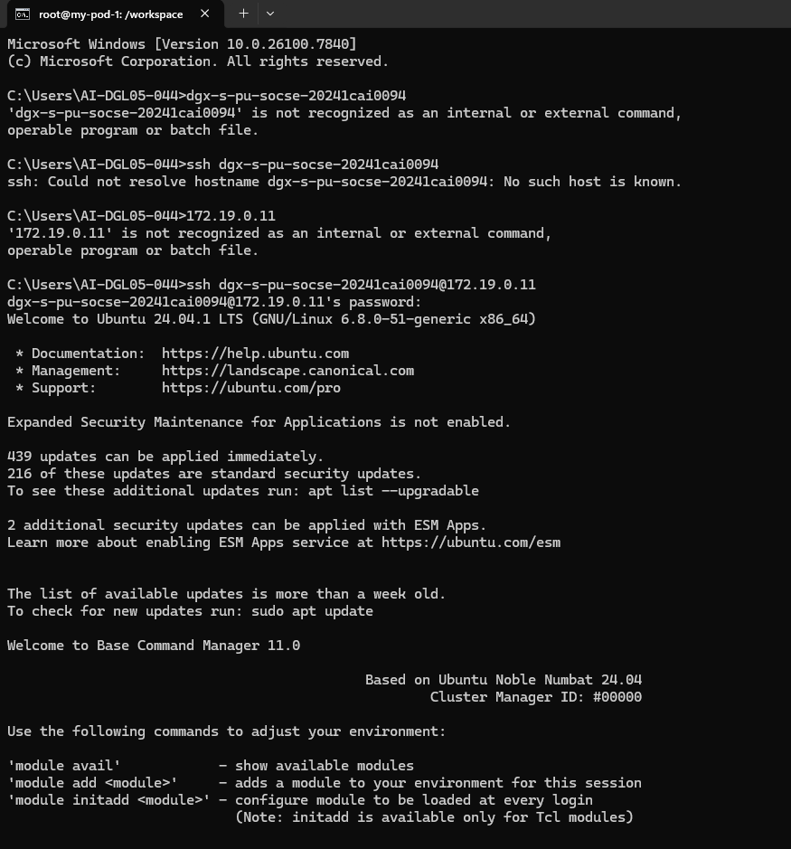
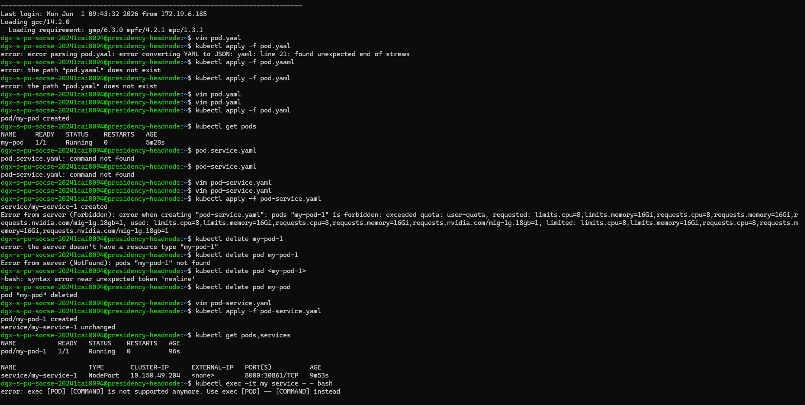
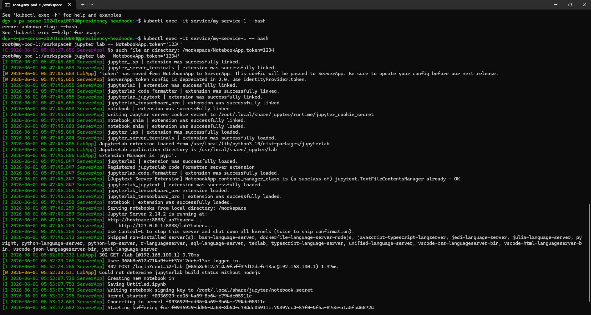
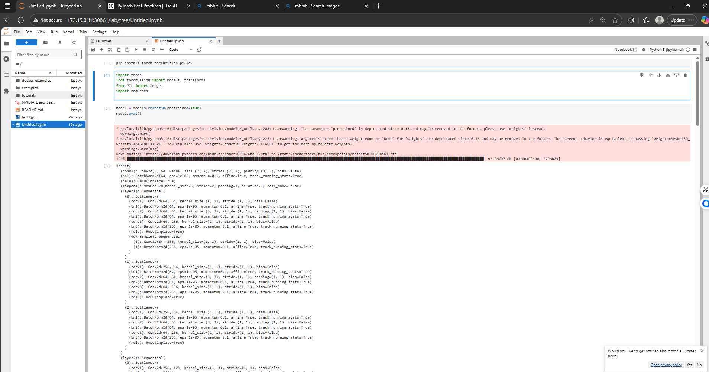
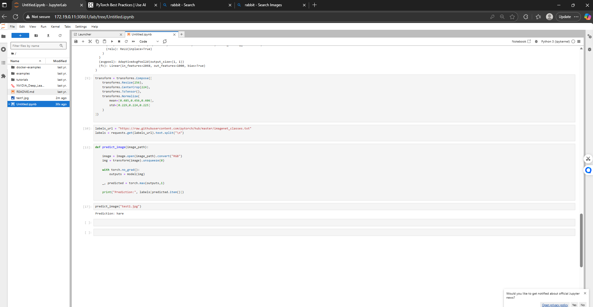

# Day 1: Internship progress 
Date : 1 June 2026
# # Topics covered 
Introduction to kubernetes .
Creating and configuring pods.
Understanding sevices in kubernetes.
Pod deployment basics.
Accessing Jupyter Notebook.

# # Hands-on work 
Created and configured pods.
Created and configured services. 
Explored kubernetes Services. 
Accessed Jupyter Notebook.
Ran a program in Jupyter. 

# # Key learning 
Learned the basics of kubernetes, Pod deployment , and how to use Jupyter Notebook in provided environment . 

# # output screenshots 

